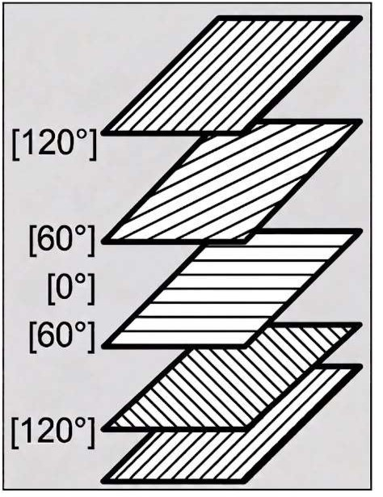

<div align="center">


# Safecomposites3D

### The fast, desktop app that turns your composite laminate design into validated strains and stresses in seconds.

**Safecomposites3D helps you design, calculate, and validate a multi-layer composite laminate in seconds — no spreadsheet, no hand-written Classical Laminate Theory matrices.**

[](https://www.python.org/)
[](https://doc.qt.io/qtforpython/)
[](#why-safecomposites3d)
[](#license)
[](#getting-started)

[Getting Started](#getting-started) •
[Why Safecomposites3D](#why-safecomposites3d) •
[Demo](#demo) •
[Features](#features) •
[Roadmap](#roadmap) •
[Contributing](#contributing)

</div>

---

## Let's validate Safecomposites3D

<div align="center">


<video src="./assets/safecomposites3d-demo.mp4" controls width="800" poster="[./assets/safecomposites3d-preview.gif](https://github.com/user-attachments/assets/995f591f-1998-4b36-ba52-91b04a29fe86)">
  Your browser does not support HTML5 video. <a href="./assets/safecomposites3d-demo.mp4">Download the video here</a>.
</video>

*Let's validate Safecomposites3D with this example here: a quasi-isotropic, symmetric, balanced [120°/60°/0°/60°/120°] laminate — from opening the app to the global strain results, in under 2 minutes.*



*A 5-layer [120°/60°/0°/60°/120°] laminate — quasi-isotropic, symmetric (no bending-torsion coupling), and balanced — modeled, solved, and validated end-to-end inside Safecomposites3D.*

</div>

---

## A second example: catching a real bending-torsion coupling case

<div align="center">


*Global strain result for an asymmetric [0°/0°/0°/90°] laminate under a simple in-plane tension load, computed by Safecomposites3D.*

</div>

The laminate above is **[0°/0°/0°/90°]** — four layers, and unlike the quasi-isotropic benchmark, **not symmetric** about the mid-plane. A single, simple tension load was applied — nothing exotic — and the global strain plot tells the real story: **Epsilon_yy**, the strain *perpendicular* to the applied tension, comes out with **opposite signs at the top and bottom of the laminate** (positive on one face, negative on the other). That sign flip through the thickness is the signature of a real **bending-torsion coupling strain/stress** — the laminate doesn't just stretch, it curves/twists out of plane in a direction the applied load was never supposed to produce, purely because the stacking sequence is asymmetric.

This is exactly the kind of failure mode that is easy to miss on paper and expensive to discover late — normally it only shows up once an engineering team has already built a full FEM model, meshed it, and pushed it through a mesh-convergence study, a process that routinely takes **weeks** for a single stacking sequence. With Safecomposites3D, the same laminate — same material data, same geometry, same load — is checked in **about 1 second**, and the coupling is visible immediately in the global strain plot, before a single mesh is ever built.

That speed changes what becomes practical for an engineering team: instead of committing weeks of modeling or physical testing to find out a layup has an unwanted coupling problem, engineers can catch it — and redesign around it — in the time it takes to enter the numbers. In practice, that means:

- 🛡️ **Preventing a real design failure before it's built**, by simply re-ordering or re-balancing the stacking sequence and re-checking instantly, instead of discovering the coupling after tooling or a physical prototype already exists.
- 🧵 **Helping prevent delamination**, since unwanted bending-torsion/bending-extension coupling and the internal ply-to-ply stress mismatches it creates are a known contributor to delamination risk in service — catching the coupling early is catching a delamination risk early too.
- 🏭 **Making composite adoption at scale simpler and safer for industry**, across manufacturing, design, and the wider supply chain — because the same fast, 1-second check that validates one laminate for one engineer scales to validating dozens of candidate layups across a production program, without a proportional increase in engineering time.
- ♻️ **Supporting more sustainable composite use**, by cutting down on the physical test panels, scrapped prototypes, and rework that come from discovering a coupling or delamination problem late — validating the layup digitally, first, means fewer wasted materials and fewer wasted manufacturing cycles across the composite's lifecycle.

---

## Why Safecomposites3D

Most composite laminate analysis today still happens in one of two extremes: **hand-built Classical Laminate Theory (CLT) spreadsheets** that are slow, error-prone, and impossible to hand off between engineers — or **full-blown FEA/composite suites** with a licensing cost and a learning curve that only a dedicated specialist can justify.

**Safecomposites3D is built to close that gap**, and it does it by deliberately optimizing the learning curve on **three axes at once**, instead of trading one off against the others:

- 🧠 **Capability** — full layer-by-layer Classical Laminate Theory under the hood: material stiffness matrices (Q, Q̄), laminate stiffness matrices (A, B, D, H), in-plane strains and curvatures (ε₀, κ), and per-layer strains and stresses in each ply's own axes — the same physics a composites textbook (Gay, Berthelot) walks you through, computed for you.
- 🎯 **Usability** — a guided desktop interface: enter material properties, boundary loads, and layer angles/thicknesses, and get strain and stress results laid out per layer, without writing a single line of matrix algebra.
- ⚡ **Simplicity** — from opening the app to a validated result in well under a couple of minutes for a standard laminate, with sensible defaults and a layout that doesn't require reading a manual first.

That three-axis optimization — capability, usability, and simplicity together — is what turns Safecomposites3D from "a calculator" into a **real productivity gain**: the same way TurboFEM shortens the path from "we have a mechanical question" to "we have a validated answer" for structural FEA, Safecomposites3D shortens that same path for **composite laminate design**.

### One core application: catching bending-torsion coupling before it becomes a problem

One of Safecomposites3D's main practical uses is validating a laminate stacking sequence **specifically for bending-torsion (and bending-extension) coupling strain/stress** — the effect where certain layer arrangements are not symmetric about the mid-plane, so a *simple in-plane load turns into curvature/twist* that was never intended in the design (the exact B ≠ 0 effect the tool computes directly).

Checking for that today usually means building a full FEM model, meshing it, and iterating on mesh refinement until the solution converges — a process that can take engineers **weeks** to set up, run, and validate properly for a single stacking sequence. Safecomposites3D gets you the same answer in **about 1 second**, from nothing more than the material data and the laminate's geometry (layer angles, thicknesses, and applied loads) — no mesh, no convergence study, no FEM model to build at all. That difference is the whole point: it turns "is this layup safe from unwanted coupling?" from a multi-week FEM campaign into a question you can answer, and re-answer for a dozen candidate layups, in the time it takes to type in the numbers.

And because composites are no longer a niche material choice, that time saved compounds across industries:

- ✈️ **Aerospace** — skins, spars, and stiffened panels where quasi-isotropic and balanced-symmetric layups (like the [120/60/0/60/120] benchmark above) are the everyday starting point for a structural check.
- 🚗 **Automotive** — lightweighting of structural and semi-structural composite parts, where fast iteration on layup angle and stacking sequence directly affects program timelines.
- 🏗️ **Civil construction** — composite reinforcement and structural retrofit, a domain where composites are being adopted at a fast-growing pace and where a quick, trustworthy laminate check is often the bottleneck.

If your team designs or validates laminates regularly, and every extra hour spent rebuilding CLT matrices by hand is an hour not spent on the actual engineering problem, Safecomposites3D is built exactly for that.

---

## Features

| | |
|---|---|
| 🖥️ **Desktop GUI** | Full graphical interface — no scripting required to run a laminate calculation |
| 📐 **Classical Laminate Theory engine** | Computes Q, Q̄, A, B, D, and H matrices from your material properties and stacking sequence |
| 🧱 **Layer-by-layer laminate builder** | Define angle and thickness per layer, up to multi-layer stacks, with live height/z-position tracking |
| 📊 **Global and per-layer results** | In-plane strains (ε₀), curvatures (κ), and per-layer strains/stresses in each ply's own material axes |
| ⚖️ **Load input as running loads** | Enter total applied forces and part width, and Safecomposites3D converts them to the running loads (N/mm) CLT actually works with |
| 📈 **Graphical strain/stress plots** | Visualize how strain and stress vary through the thickness of the laminate |
| 🌐 **Multi-language interface** | Ships with multiple languages (starting with French and English), switchable per build |
| 📦 **Standalone Windows build** | Packaged as a distributable `.exe` via PyInstaller — no Python setup required for end users |

---

## Getting Started

### Option 1 — Run the packaged app (recommended for most users)

1. Download `Safecomposites3D.exe` directly: **[Download Safecomposites3D.exe](https://1drv.ms/u/c/77d97863382bfb2f/IQBHgaoL8NUVQafpur85CKwOAbmVPV8xCzAI2-o2H940iCM)**
2. Install it in a path **without spaces** in the folder names.
3. Run `Safecomposites3D.exe`.
4. Enter your material properties and boundary conditions, define your layers, and validate your laminate.

### Option 2 — Run from source

```bash
# Requires Python already installed
python main_Safecomposite_versions.py
```

On first run (with an internet connection), Safecomposites3D automatically installs the Python packages it needs.

### Building the executable yourself

```bash
# From the Safecomposites3D_exe folder
python builder_of_Safecomposite_exe.py
```

This script uses [PyInstaller](https://pyinstaller.org/) to package the app into a standalone `Safecomposites3D.exe` — no separate PyInstaller command-line setup needed, the builder script handles it.

> 💡 **Tip:** To reset Safecomposites3D to a different display language, edit the local `keys.txt` config file next to the app and relaunch.

---

## Demo

The full walkthrough above validates a classic **quasi-isotropic, symmetric, balanced laminate** end-to-end — the [120°/60°/0°/60°/120°] benchmark:

1. Enter the material coefficients (EL, ET, GLT, VLT) and the applied boundary loads
2. Define each layer's angle and thickness (5 layers, symmetric about the mid-plane)
3. Validate the stacking sequence and compute the A, B, D, H matrices
4. Inspect the global in-plane strains and, layer by layer, the local strains and stresses

This benchmark is a deliberate choice: because the layup is quasi-isotropic, symmetric, and balanced, the results have known, checkable properties (for instance, no bending-torsion coupling — B = 0), which makes it the natural first case every user runs to trust the tool before moving on to their own design.

---

## Tech Stack

- **Language:** Python
- **GUI:** PySide6 (and a Tkinter-based calculation interface)
- **Method:** Classical Laminate Theory (CLT) — NumPy-based matrix computation
- **Packaging:** PyInstaller
- **Localization:** custom translation engine, multiple languages included

---

## Roadmap

Safecomposites3D is under active development. Planned directions include:

- [ ] Failure criteria (Tsai-Wu, Tsai-Hill, max stress/strain) on top of the current strain/stress output
- [ ] More built-in material presets for common carbon/glass/aramid systems
- [ ] Expanded 3D visualization of the laminate and its deformed shape
- [ ] Continued expansion of built-in languages

---

## Contributing

Contributions, issues, and feature requests are welcome. If you're an engineer who hits a wall using Safecomposites3D on a real laminate, that friction is exactly the kind of feedback that shapes the roadmap.

---

## License

Safecomposites3D is licensed under the **MIT License**. See [`LICENSE`](./LICENSE) for the full text.

---

<div align="center">

Built by engineers, for engineers who need a validated laminate — not a second job rebuilding Classical Laminate Theory matrices by hand.

</div>
